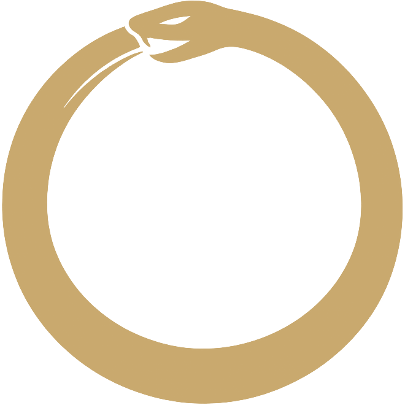

<div align="center">



<!-- omit in toc -->
# karate

**Run Karate API and integration tests in CI — REST, GraphQL, WebSocket, mock server.**

Alpine-based image bundling the [Karate](https://github.com/karatelabs/karate) fat jar on top of `eclipse-temurin:21-jre-alpine`, with `bash` and `ca-certificates` for shell wrappers and HTTPS test targets. Ships a CI/CD component — one include runs a `.feature` suite and publishes the HTML report as a job artifact.

[](https://gitlab.com/coroboros/infrastructure/karate/-/releases)
[](https://gitlab.com/coroboros/infrastructure/karate/-/pipelines)
[](https://github.com/orgs/coroboros/packages/container/package/karate)
[](https://hub.docker.com/r/coroboros/karate)
[](LICENSE.md)
[](https://gitlab.com/coroboros/infrastructure/karate)
[](https://github.com/coroboros/agent-skills)
[](https://coroboros.com)

</div>

<!-- omit in toc -->
## Contents

- [Requirements](#requirements)
- [Image](#image)
- [Tags](#tags)
- [Commands](#commands)
- [Run](#run)
- [Reports](#reports)
- [Agents](#agents)
- [Packages](#packages)
- [Provenance](#provenance)
- [Compared to alternatives](#compared-to-alternatives)
- [Security](#security)
- [Contributing](#contributing)
- [License](#license)

## Requirements

Docker, BuildKit, or any OCI runtime able to pull from the GitHub Container Registry (or the Docker Hub mirror).

## Image

`ghcr.io/coroboros/karate:{tag}` — mirrored to `docker.io/coroboros/karate:{tag}`, and in the GitLab Container Registry at `registry.gitlab.com/coroboros/infrastructure/karate:{tag}`.

- **Architectures**: `linux/amd64`, `linux/arm64`
- **Working directory**: `/karate`
- **Entrypoint**: `karate`
- **Default command**: `/karate/features`
- **User**: non-root `karate` (uid 10000)
- **Volumes**: `/karate/features` (mount feature files), `/karate/target` (test output)

## Tags

| Tag | Karate | JRE base | Architectures | Size | Source | Mutability |
| --- | --- | --- | --- | --- | --- | --- |
| `2.0.9-temurin21` | [`2.0.9`](images/2.0.9-temurin21/image.env) | [`eclipse-temurin:21-jre-alpine`](images/2.0.9-temurin21/image.env) | `amd64`, `arm64` | 99.7 MB (amd64), 99.4 MB (arm64) | current matrix row | rolling |
| `<sha>-2.0.9-temurin21` | varies by build | varies by build | varies by build | varies by build | every `2.0.9-temurin21` build | immutable |

Sizes are compressed layer sums from the GitLab Container Registry. The image tag selects the Karate runner and Java runtime; the repo SemVer tag versions the GitLab CI/CD component. Pin a digest for reproducible builds; see [Provenance](#provenance).

## Commands

`karate [options] [feature_path]`

<details>
<summary><code>feature_path</code></summary>

<br>

One or more `.feature` files or directories. Defaults to `/karate/features` (the image's exposed volume).

</details>

<details>
<summary><code>options</code></summary>

<br>

Forwarded to the Karate runner. Full reference: [Karate CLI options](https://github.com/karatelabs/karate/wiki/Karate-Options). Most useful flags:

| Flag | Purpose |
| --- | --- |
| `-h` | Print help and exit. |
| `-t @tag` | Run only scenarios tagged `@tag`. Combinable: `-t @smoke,~@wip`. |
| `-T <n>` | Run `<n>` features in parallel. |
| `-o <dir>` | Override the output directory (default `/karate/target`). |
| `-e <env>` | Set `karate.env` (per-environment config). |

</details>

<details>
<summary><code>Environment variables</code></summary>

<br>

| Variable | Default | Purpose |
| --- | --- | --- |
| `LANG` | `C.UTF-8` | Locale, set in the image for consistent JVM behaviour. |
| `JAVA_TOOL_OPTIONS` | unset | Standard JVM tuning hook — heap, GC, system properties (`-Dkarate.env=...`). |

</details>

<details>
<summary><code>Examples</code></summary>

<br>

```shell
karate /karate/features
```

```shell
karate -T 4 -t @smoke /karate/features/api
```

</details>

## Run

<details>
<summary>GitLab CI</summary>

<br>

```yaml
api-tests:
  image:
    name: registry.gitlab.com/coroboros/infrastructure/karate:<tag>
    entrypoint: [""]
  stage: test
  script:
    - karate features
  artifacts:
    when: always
    paths:
      - target/
```

```yaml
parallel-tests:
  image:
    name: registry.gitlab.com/coroboros/infrastructure/karate:<tag>
    entrypoint: [""]
  stage: test
  script:
    - karate -T 4 -t @smoke features
```

</details>

<details>
<summary>CI/CD component</summary>

<br>

One include runs the suite and publishes the HTML report as a job artifact. A test failure fails the job; set `allow_failure: true` to keep it advisory.

```yaml
include:
  - component: gitlab.com/coroboros/infrastructure/karate/karate@<version>
    inputs:
      feature_path: features
      parallel: 4
      tags: "@smoke,~@wip"
```

The final `/karate` segment is the component name from `templates/karate.yml`; GitLab component refs are `<fqdn>/<project-path>/<component-name>@<version>`.

Inputs: `job_name`, `stage`, `feature_path`, `parallel`, `tags`, `env`, `output_dir`, `options`, `java_tool_options`, `allow_failure`, `image` — see [`templates/karate.yml`](templates/karate.yml). The component version is this repo's SemVer, independent of the image tag.

</details>

<details>
<summary>Docker</summary>

<br>

Mount the features directory and run:

```shell
docker run --rm \
  -v "$PWD/features:/karate/features" \
  -v "$PWD/target:/karate/target" \
  registry.gitlab.com/coroboros/infrastructure/karate:<tag>
```

```shell
docker run --rm \
  -v "$PWD/features:/karate/features" \
  -v "$PWD/target:/karate/target" \
  registry.gitlab.com/coroboros/infrastructure/karate:<tag> \
  -T 4 -t @smoke
```

</details>

## Reports

Karate writes an HTML report (`karate-summary.html`, per-feature pages, a timeline) to the output directory (`-o`, default `target`). The [CI/CD component](#run) collects it as a job artifact; open `karate-summary.html` for pass/fail per scenario. A failed scenario exits non-zero, so the job fails regardless.

## Agents

karate ships an agent skill — its own write-and-run guide for Karate feature tests — for coding agents. Install it into an agent:

```sh
npx skills add https://gitlab.com/coroboros/infrastructure/karate
```

Or read it without installing: [`skills/karate/SKILL.md`](skills/karate/SKILL.md).

## Packages

Same across all Karate tags.

| Package | Purpose |
|---|---|
| `eclipse-temurin` (JRE) | Java runtime |
| `karate` | Karate fat jar at `/karate/karate.jar` + `karate` wrapper at `/bin/karate` |
| `bash` | Shell |
| `ca-certificates` | TLS certificate bundle for Karate HTTPS test requests |

Image rows are declared in [`images/`](images). Dockerfile defaults stay synced for local builds. Renovate maintains the current Karate row and its JAR checksum in one merge request, and refreshes the current JRE base digest.

## Provenance

Every published image, via the shared [`coroboros/ci`](https://gitlab.com/coroboros/ci) `container-images` template, is:

- **multi-arch** — BuildKit, `linux/amd64,linux/arm64`;
- **gated** — source secrets via `gitleaks`, image CVEs via Trivy on the published `:sha`, and the offline Karate smoke feature before tag promotion;
- **signed** — cosign keyless on the immutable digest, with a **CycloneDX SBOM** attestation.

The signed digest is published to `ghcr.io/coroboros/karate` and mirrored to `docker.io/coroboros/karate` on version tags.

### Pinning

`2.0.9-temurin21` is a **rolling image tag for that Karate/JRE pair**. Base-image CVE fixes can move it; exact reproducibility uses the signed digest. The CI matrix is the support list: a new Karate version gets a new `<karate-version>-<runtime>` row, and a different Java runtime gets its own row only after compatibility is verified.

For reproducible, tamper-evident builds, pin the **manifest-list digest** (multi-arch) through the `image` input and let Renovate keep it current:

```yaml
include:
  - component: gitlab.com/coroboros/infrastructure/karate/karate@<version>
    inputs:
      image: registry.gitlab.com/coroboros/infrastructure/karate:<tag>@sha256:<manifest-list-digest>
```

A cosign signature is bound to the digest, not the tag, so verify the pinned digest:

```sh
cosign verify \
  --certificate-identity-regexp 'https://gitlab.com/coroboros/infrastructure/karate//.*' \
  --certificate-oidc-issuer https://gitlab.com \
  ghcr.io/coroboros/karate@sha256:<manifest-list-digest>
```

## Compared to alternatives

### vs other API testing frameworks

| Capability | `cucumber-jvm` | `rest-assured` | `postman` / `newman` | `playwright` (API) | **`karate`** |
| --- | :---: | :---: | :---: | :---: | :---: |
| BDD-style feature syntax | yes | no | no | no | yes |
| HTTP / REST testing | via libs | yes | yes | yes | yes |
| GraphQL testing | via libs | as raw HTTP | yes (UI / scripts) | as raw HTTP | yes |
| Built-in match assertion (fuzzy / schema) | no | no | no | no | yes |
| Parallel execution | runner-specific | runner-specific | yes | yes | yes (`-T`) |
| Mock server included | no | no | yes (UI) | no | yes |
| Single-binary execution | no | no | yes | no | yes (fat jar) |
| No glue code (Java / JS) | no | no | yes | no | yes |

Difference: karate combines BDD-style feature files with built-in HTTP / GraphQL / WebSocket clients, schema-aware `match` assertions, and a mock server — from a single fat jar with no glue code.

### vs other Karate Docker images

| Image | Base | Size | Last update | Focus |
| --- | --- | --- | --- | --- |
| `karatelabs/karate-chrome` (official) | Ubuntu + Chrome + Xvfb + VNC | ~800 MB | ~6 months ago | Browser automation |
| `tgintegrationtests/karate` (community) | unspecified | — | ~7 months ago | General-purpose |
| `remarkableas/karate` (community) | unspecified | — | ~5 years ago | Stale |
| `ibmurai/karate` (community) | unspecified | — | ~7 years ago | Stale |
| **`coroboros/infrastructure/karate`** | `eclipse-temurin:21-jre-alpine` | 99.7 MB (amd64), 99.4 MB (arm64) | rolling | API / integration testing |

Difference: the official `karatelabs/karate-chrome` bundles Chrome + Xvfb + VNC for browser automation — ~800 MB, overkill for pure API testing. Community images are stale (5–7 years). This image strips back to JRE 21 + Karate fat jar on Alpine: about 8× smaller, current, non-root, with `features` / `target` exposed as volumes.

## Security

Report a vulnerability privately via the [security policy](SECURITY.md) — **ob@coroboros.com**, never a public issue.

## Contributing

Bug reports and merge requests welcome.

- Open an issue before submitting non-trivial merge requests.
- Commits follow [Conventional Commits](https://www.conventionalcommits.org/).
- Sign off each commit (DCO): `git commit -s`.
- Target the `main` branch.

## License

[Apache 2.0](LICENSE.md)
